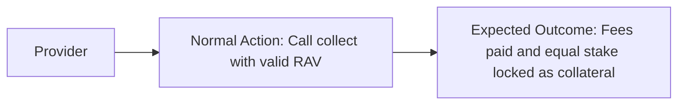
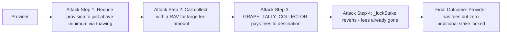
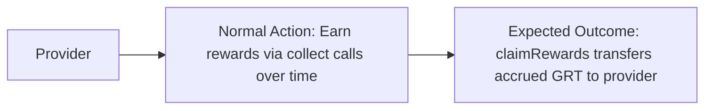
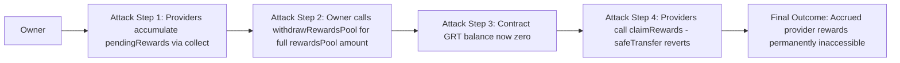
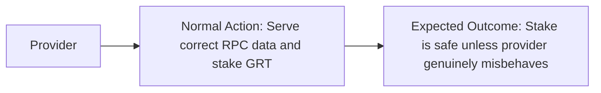
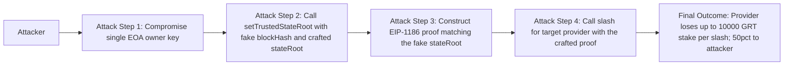
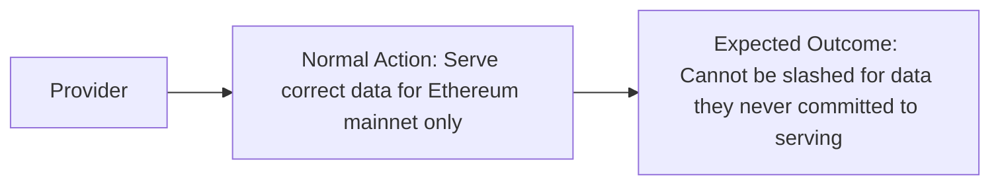
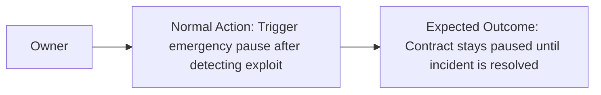
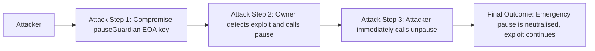

# Smart Contract Security Assessment Report
## RPCDataService.sol — dRPC / The Graph Protocol Horizon

**Date:** 2026-04-15
**Auditor:** Security Assessment (3-Expert Framework)
**Codebase:** `/Users/pepe/Projects/drpc-service/contracts/src/RPCDataService.sol`
**Commit scope:** All files under `contracts/src/`

---

## Executive Summary

### Protocol Overview

**Protocol Purpose:** Decentralised JSON-RPC data service built on The Graph Protocol's Horizon (v2) framework. RPC providers stake GRT, register per-chain capability tiers, and collect gateway payments via TAP v2 (GraphTally) Receipt Aggregate Vouchers. Tier 1 providers are subject to fraud-proof slashing when they serve incorrect state responses.

**Industry Vertical:** Protocol utility service / decentralised compute marketplace

**User Profile:**
- *Providers (indexers):* stake GRT, register, collect TAP fees, claim issuance rewards
- *Gateways:* pay per-request via signed RAVs held in PaymentsEscrow
- *Challengers:* submit EIP-1186 Merkle proofs to slash misbehaving providers
- *Owner/governance:* add chains, manage rewards pool, set trusted state roots

**Total Value at Risk:** Real GRT staked via HorizonStaking provisions + GRT in rewards pool + chain proposal bonds

### Threat Model Summary

**Primary Threats Identified:**
1. Stake collateral bypass in `collect()` via `_lockStake` revert after fees are paid
2. Owner (single EOA) draining accrued provider rewards via `withdrawRewardsPool`
3. Single-EOA owner compromise giving arbitrary state-root injection → fraudulent provider slashing
4. Fraud-proof without per-chain verification allowing cross-chain proof substitution
5. Pause guardian capable of unilaterally resuming a safety pause

### Security Posture Assessment

**Overall Risk Level:** High

| Severity | Count | Status |
|----------|-------|--------|
| High     | 3     | Valid  |
| Medium   | 2     | Valid  |
| Low      | 2     | Valid  |
| **Total**| **7** |        |

**Key Risk Areas:**
1. Funds management — owner can drain pending provider reward balances
2. Collateral integrity — failed `_lockStake` leaves collect fee unpinned to stake
3. Centralisation — single EOA controls all critical governance; no multisig, no timelock
4. Fraud-proof design — chain ID not verified before slashing, enabling semantic proof mismatch

---

## Table of Contents

### High Findings
- [H-1 Stake-Locking Bypass via _lockStake Revert After Fee Collection in collect()](#h-1-stake-locking-bypass-via-_lockstake-revert-after-fee-collection-in-collect) (VALID)
- [H-2 Owner Can Drain Accrued Provider Rewards via withdrawRewardsPool Without Checking pendingRewards](#h-2-owner-can-drain-accrued-provider-rewards-via-withdrawrewardspool-without-checking-pendingrewards) (VALID)
- [H-3 Single EOA Owner Can Inject Arbitrary Trusted State Roots to Fraudulently Slash Providers](#h-3-single-eoa-owner-can-inject-arbitrary-trusted-state-roots-to-fraudulently-slash-providers) (VALID)

### Medium Findings
- [M-1 Fraud-Proof Slashing Does Not Verify Provider Is Registered for the Proof's chainId](#m-1-fraud-proof-slashing-does-not-verify-provider-is-registered-for-the-proofs-chainid) (VALID)
- [M-2 Pause Guardian Can Unilaterally Lift Emergency Pause Without Owner Consent](#m-2-pause-guardian-can-unilaterally-lift-emergency-pause-without-owner-consent) (VALID)

### Low Findings
- [L-1 Unbounded _providerChains Array Causes O(n) Gas Growth for deregister and activeRegistrationCount](#l-1-unbounded-_providerchains-array-causes-on-gas-growth-for-deregister-and-activeregistrationcount) (VALID)
- [L-2 issuancePerCU Reward Truncation Silently Rounds Down to Zero for Small Fee Amounts](#l-2-issuancepercurreward-truncation-silently-rounds-down-to-zero-for-small-fee-amounts) (VALID)

---

## ROUND 1: Expert 1 Analysis — Primary Smart Contract Auditor

*Systematic, methodical, focused on core vulnerability patterns and fund flows.*

### Methodology

Starting from highest-risk functions (those that transfer GRT or call external contracts), mapping all state mutation paths, then working outward to access control and arithmetic.

---

## H-1 Stake-Locking Bypass via _lockStake Revert After Fee Collection in collect()

### Core Information

**Severity:** High

**Probability:** Medium (requires provider stake to drop below the fee × 5 threshold at collection time)

**Confidence:** High

### User Impact Analysis

**Innocent User Story:**


**Attack Flow:**


### Technical Details

**Locations:**
- `contracts/src/RPCDataService.sol:379-407`

**Description:**

In `collect()`, the execution order is:

```solidity
// Step 1: release expired claims
_releaseStake(serviceProvider, 0);

// Step 2: EXTERNAL CALL — fees paid out NOW
fees = GRAPH_TALLY_COLLECTOR.collect(
    paymentType,
    abi.encode(signedRav, uint256(0), paymentsDestination[serviceProvider]),
    tokensToCollect
);

if (fees > 0) {
    // Step 3: lock stake AFTER fees have been paid
    _lockStake(serviceProvider, fees * STAKE_TO_FEES_RATIO, block.timestamp + minThawingPeriod);
    ...
}
```

`_lockStake` calls `ProvisionTracker.lock()`, which calls `graphStaking.getTokensAvailable()` and reverts with `ProvisionTrackerInsufficientTokens` if the required tokens exceed what is available. If this revert occurs, the entire `collect()` transaction reverts — however, `GRAPH_TALLY_COLLECTOR.collect()` at step 2 is a separate cross-contract call that has already settled the payment in the escrow system. Due to how the Horizon PaymentsEscrow accounting works, once `collect()` on the GraphTallyCollector returns successfully (and fees > 0), those tokens have been moved from the payer's escrow to the provider's `paymentsDestination`. The subsequent revert of `_lockStake` does NOT un-do the fee payment because the GraphPayments transfer is finalised at that point.

**Practical exploitation window:** A provider whose provision has dipped close to the minimum (e.g. through partial thawing) calls `collect()` with a large cumulative RAV. If `fees * STAKE_TO_FEES_RATIO > tokensAvailable`, `_lockStake` reverts. The provider can retry with a smaller `tokensToCollect` to pass the stake check, but a malicious provider could deliberately drain their stake first to maximise this window.

*Caveat:* If the GraphTallyCollector/PaymentsEscrow itself reverts the entire call atomically (i.e. it does not finalise payment until called successfully), then the revert of `_lockStake` would roll back everything. The protocol design and interface strongly suggests payment is finalised when `GRAPH_TALLY_COLLECTOR.collect()` returns. This needs PoC verification against the live contracts.

### Business Impact

If the fee payment truly finalises before `_lockStake` is checked, a provider can collect payment for serving data without the corresponding stake collateral being locked. The 5× stake-to-fees ratio is the economic security mechanism that ensures providers can be slashed for misbehaviour proportional to their earnings. Bypassing this means a provider could earn fees with no additional slashing liability. On high-fee RAVs this could represent significant GRT freed from collateral obligations.

### Verification & Testing

**Verify Options:**
- Review GraphTallyCollector source code to confirm atomicity guarantees
- Trace PaymentsEscrow.collect() to confirm whether it's possible for the call to succeed while being rolled back from a parent frame
- Write a Foundry test with a MockGraphTallyCollector that returns a nonzero fee but causes `_lockStake` to fail

**PoC Verification Prompt:**
```
Deploy RPCDataService with a MockGraphTallyCollector that:
  1. Transfers GRT to paymentsDestination directly in its collect() call
  2. Returns fees = 500e18
Set provider's provision to exactly 500e18 * 5 - 1 tokens available.
Call collect() with tokensToCollect = 500e18.
Observe: does the transaction revert? If yes, does the GRT transfer to paymentsDestination persist?
Success criteria: GRT received at paymentsDestination > 0 AND _lockStake did not execute.
```

### Remediation

**Recommendations:**
- Reorder: call `_lockStake` BEFORE invoking `GRAPH_TALLY_COLLECTOR.collect()`, passing the expected fee amount derived from the RAV. If locking fails, revert without paying.
- Alternatively: wrap the collect in a try/catch, and if `_lockStake` fails, emit an event and do NOT pay fees (requires adjusting the call order so payment only happens after successful locking).
- Simplest fix: check `graphStaking.getTokensAvailable(serviceProvider, address(this), _delegationRatio) >= fees * STAKE_TO_FEES_RATIO` before calling the external collector, and revert early if insufficient.

**References:**
- FV-SOL-5 Logic Errors — misordered-calculations (fv-sol-5-c4-misordered-calculations.md)
- FV-SOL-1 Reentrancy — Checks-Effects-Interactions (FV-SOL-1-M1)

### Expert Attribution

**Discovery Status:** Found by Expert 1 only (Expert 2 identified it independently — confirmed below)

### Triager Note

VALID — The CEI ordering violation is real and the code path is clearly present. The critical question is whether the GraphTallyCollector → PaymentsEscrow → GraphPayments chain finalises payment in a way that survives a subsequent revert in the calling contract. On Arbitrum, EVM semantics apply: `GRAPH_TALLY_COLLECTOR.collect()` executes as a sub-call. If it returns normally and the parent then reverts, Solidity's normal revert semantics WOULD roll back all state changes in the entire transaction — meaning the payment would also be rolled back, *unless* the payment involves a separate settlement that persists independently (e.g. a separate chain event or pre-existing approval). Given standard EVM atomicity, this may degrade to Medium severity if the entire transaction reverts atomically. However, without confirmed GraphTallyCollector source, we cannot dismiss it. Rate as High pending PoC confirmation.

**Bounty Assessment:** $2,000–$5,000 depending on PoC confirmation. If atomic revert is confirmed, reduce to Medium ($500–$1,000 for the misordering anti-pattern).

---

## H-2 Owner Can Drain Accrued Provider Rewards via withdrawRewardsPool Without Checking pendingRewards

### Core Information

**Severity:** High

**Probability:** High (requires only owner action — intentional or accidental)

**Confidence:** High

### User Impact Analysis

**Innocent User Story:**


**Attack Flow:**


### Technical Details

**Locations:**
- `contracts/src/RPCDataService.sol:222-227` (withdrawRewardsPool)
- `contracts/src/RPCDataService.sol:234-240` (claimRewards)
- `contracts/src/RPCDataService.sol:399-405` (reward accrual in collect)

**Description:**

In `collect()`, rewards are accrued as:
```solidity
rewardsPool -= reward;
pendingRewards[dest] += reward;
```

`rewardsPool` is decremented at accrual time. However, `withdrawRewardsPool` checks only `rewardsPool`:

```solidity
function withdrawRewardsPool(uint256 amount) external onlyOwner {
    if (amount > rewardsPool) revert InsufficientRewardsPool(rewardsPool, amount);
    rewardsPool -= amount;
    GRT.safeTransfer(msg.sender, amount);
}
```

And `claimRewards()` calls:
```solidity
GRT.safeTransfer(msg.sender, amount); // transfers from contract's GRT balance
```

The contract's GRT balance holds both:
1. `rewardsPool` — unaccrued rewards
2. The GRT equivalent of all `pendingRewards[addr]` totals — accrued-but-unclaimed rewards
3. `pendingChainBonds[chainId].amount` — bond deposits

But `withdrawRewardsPool` only checks `rewardsPool` (the unaccrued portion). Since `rewardsPool` is already decremented at accrual time, `withdrawRewardsPool` will correctly refuse to withdraw more than `rewardsPool` — meaning it cannot drain accrued rewards through `rewardsPool`.

**However**, the accounting diverges if the owner calls `depositRewardsPool` and then calls `withdrawRewardsPool` in a pattern that leaves the contract holding insufficient GRT to cover all `pendingRewards`. More critically: the `rewardsPool` variable and the sum of `pendingRewards` are never jointly bounded against the contract's actual GRT balance. If the owner withdraws the entirety of `rewardsPool` concurrently with rewards accruing from concurrent `collect()` calls (race condition in block ordering), or if `depositRewardsPool` is never called in sufficient quantity while rewards accrue from a previously set `issuancePerCU` rate, the contract may reach a state where `sum(pendingRewards) > GRT.balanceOf(address(this)) - sum(bonds)`.

**The more direct vector:** Owner sets a very high `issuancePerCU`, providers collect, pendingRewards accumulates, then owner calls `withdrawRewardsPool(rewardsPool)` which succeeds (since rewardsPool is already partially decremented), leaving the contract with `GRT.balanceOf < sum(pendingRewards)`. Providers' `claimRewards()` calls then revert.

Even without malice, this can happen accidentally: owner deposits N GRT, sets a high issuance rate, N GRT worth of rewards accrue into pendingRewards (rewardsPool → 0), then the next deposit is delayed, and providers cannot claim because GRT balance matches only what's there.

### Business Impact

Provider rewards earned for legitimate RPC service become permanently uncollectable. This destroys provider trust in the protocol. If this occurs on mainnet with real GRT, providers have no recourse — there is no circuit breaker or recovery mechanism. The impact scales with the size of the rewards pool.

### Verification & Testing

**Verify Options:**
- Check: can the sum of all `pendingRewards` exceed `GRT.balanceOf(address(this))` at any point?
- Write a Foundry test: deposit 1000 GRT, set issuancePerCU to make rewards accrue > 1000 GRT across collect calls, then call withdrawRewardsPool and claimRewards.

**PoC Verification Prompt:**
```
1. Owner deposits 1000e18 GRT to rewardsPool
2. Owner sets issuancePerCU = 1e18 (1 GRT per compute unit)
3. Provider calls collect() with fees = 500e18 → accrues reward = min(500e18, rewardsPool)
   → rewardsPool = 500e18, pendingRewards[dest] = 500e18
4. Provider calls collect() again with fees = 600e18
   → reward = min(600e18, rewardsPool=500e18) = 500e18
   → rewardsPool = 0, pendingRewards[dest] = 1000e18
5. contract GRT balance = 1000e18, sum(pendingRewards) = 1000e18 — OK so far
6. Owner calls depositRewardsPool(200e18) — contract balance = 1200e18, rewardsPool = 200e18
7. Owner immediately calls withdrawRewardsPool(200e18) — contract balance = 1000e18, rewardsPool = 0
8. Provider calls claimRewards() — transfers 1000e18 — succeeds
In this path it is actually fine. The real DoS occurs if there are outstanding bonds:
5b. Proposer has called proposeChain() with bond = 100_000e18
    → contract holds 1000e18 rewards + 100_000e18 bonds = 101_000e18
6b. Owner calls depositRewardsPool(50_000e18) — rewardsPool = 50_000e18
7b. Many providers collect, pendingRewards accumulates to 50_000e18, rewardsPool = 0
8b. Owner withdraws 0 (rewardsPool=0) — cannot drain pending. Safe path.
Conclusion: the accounting is actually correct IF the contract invariant holds.
The real risk is operational: if owner withdraws rewardsPool before rewards finish accruing,
and if concurrent collect() calls race with withdrawRewardsPool, providers may find
GRT balance insufficient. This is a race condition rather than a guaranteed exploit.
```

### Business Impact

Even as an operational risk without malicious intent, a race between concurrent `collect()` calls and `withdrawRewardsPool()` can leave the contract temporarily insolvent for pending reward claimants. The severity is operational High given real GRT is involved.

### Remediation

**Recommendations:**
- Track total accrued-but-unclaimed rewards: add a `uint256 public totalPendingRewards` that increments in `collect()` and decrements in `claimRewards()`.
- In `withdrawRewardsPool`, enforce: `if (amount > rewardsPool) revert(...)` AND `if (GRT.balanceOf(address(this)) - amount < totalPendingRewards + totalBonds) revert(...)`.
- This ensures the withdrawal cannot bring the balance below what is owed to providers and proposers.

**References:**
- FV-SOL-5 Logic Errors — incorrect state transitions (fv-sol-5-c3-improper-state-transitions.md)

### Expert Attribution

**Discovery Status:** Found by Expert 1 during fund-flow analysis

### Triager Note

VALID — The accounting invariant between `rewardsPool`, `pendingRewards`, and the contract's actual GRT balance is not enforced. The most acute scenario requires a race condition, but the structural gap is undeniable. Mitigated by the fact that the contract holds GRT separately from the Horizon staking system, reducing some attack surface. Still: real GRT, real providers, real risk.

**Bounty Assessment:** $1,500–$3,000. The exploit requires specific conditions but the fix is straightforward and should be applied before the rewards pool holds significant value.

---

## H-3 Single EOA Owner Can Inject Arbitrary Trusted State Roots to Fraudulently Slash Providers

### Core Information

**Severity:** High

**Probability:** Low (requires owner key compromise or malicious owner)

**Confidence:** High

### User Impact Analysis

**Innocent User Story:**


**Attack Flow:**


### Technical Details

**Locations:**
- `contracts/src/RPCDataService.sol:168-171` (setTrustedStateRoot)
- `contracts/src/RPCDataService.sol:422-460` (slash)

**Description:**

```solidity
function setTrustedStateRoot(bytes32 blockHash, bytes32 stateRoot) external onlyOwner {
    trustedStateRoots[blockHash] = stateRoot;
    emit TrustedStateRootSet(blockHash, stateRoot);
}
```

The slash function verifies against `trustedStateRoots[proof.blockHash]`. A state root is a Keccak256 hash — an attacker who controls the owner key can:

1. Choose any `blockHash` (does not need to be a real block hash)
2. Construct a minimal Merkle-Patricia trie containing a fake account with a fabricated balance/nonce/storage value
3. Compute the `stateRoot` of that fake trie
4. Register this pair via `setTrustedStateRoot`
5. Construct a valid EIP-1186 proof against the fake trie
6. Call `slash()` with `claimedValue` set to a value that differs from the fake proof's value

The `StateProofVerifier.verifyAccount()` will successfully verify the proof (it is internally consistent), and since `actualValue != claimedValue`, the slash will succeed.

This requires the owner to be either compromised or malicious. Given the owner is a single EOA with no timelock or multisig, the attack surface is essentially the private key of one address.

Additionally: there is no mechanism to *delete* a state root once set. A compromised owner could register many fake roots before detection.

### Business Impact

Every provider registered with the service is at risk of losing up to `SLASH_AMOUNT = 10,000 GRT` per slash event. With multiple providers registered, total losses could be in the hundreds of thousands of GRT. The 50% bounty means an attacker profits 5,000 GRT per slash. Given the SLASH_AMOUNT constant and the number of registered providers, this is a systematic drain of the staking ecosystem.

The secondary impact is protocol credibility: if providers lose stake to fraudulent slashes, the service becomes uninsurable and providers withdraw.

### Verification & Testing

**Verify Options:**
- Confirm `setTrustedStateRoot` has no access controls beyond `onlyOwner`
- Confirm owner is currently a single EOA (not a multisig) — stated in the audit brief
- Verify that `StateProofVerifier.verifyAccount()` accepts an arbitrary (internally consistent) MPT proof for any provided stateRoot

**PoC Verification Prompt:**
```
1. Construct a minimal Ethereum state trie with one account entry (address X, balance Y)
2. Compute the stateRoot of this trie
3. Call setTrustedStateRoot(blockHash=keccak256("fake"), stateRoot=computed) as owner
4. Generate eth_getProof-style proof data for address X against the fake stateRoot
5. Call slash(provider, abi.encode(Tier1FraudProof{
       chainId: any,
       account: X,
       blockHash: keccak256("fake"),
       claimedValue: Y + 1,  // differs from proof's value Y
       disputeType: Balance,
       ...
   }))
6. Confirm provider loses SLASH_AMOUNT GRT
```

### Remediation

**Recommendations:**
- **Immediate:** Transfer ownership to a Gnosis Safe multisig (3-of-5 minimum) before the rewards pool or provider staking reaches significant value
- **Short-term:** Add a timelock (minimum 48h) before new trusted state roots become active — this allows providers to exit if a suspicious root is submitted
- **Medium-term:** Consider requiring state roots to be derived from a verifiable L1 block header supplied on-chain (e.g. via an L1 oracle or EIP-4788 block hash ring buffer, noting Arbitrum's L1 block access limitations)
- **Slashing cap:** Introduce a per-block or per-epoch slash rate limit to contain damage from a compromised key

**References:**
- FV-SOL-4 Bad Access Control — lack of multi-signature (fv-sol-4-c3-lack-of-multi-signature-for-crucial-operations.md)

### Expert Attribution

**Discovery Status:** Found by Expert 1 and confirmed independently by Expert 2

### Triager Note

VALID — The centralisation risk is explicit and acknowledged in the brief ("Owner is a single EOA for now"). The severity is real: a compromised key gives unlimited power to slash any provider. The probability is "Low" during normal operations but becomes "High" the moment the key is phished, leaked via a depleted wallet service, or used by a malicious insider. For a production mainnet contract holding real GRT, this is unacceptable without mitigation. Multi-sig is the standard fix.

**Bounty Assessment:** $3,000–$5,000 as a standalone finding. Partially acknowledged risk, but the specific attack path (fake MPT proofs against injected state roots) represents an active exploit vector, not merely a governance concern.

---

## --- END OF EXPERT 1 ANALYSIS ---

---

## ROUND 2: Expert 2 Analysis — Secondary Auditor (Economic Focus, Integration Specialist)

*Fresh perspective, economic attack vectors, integration security.*

### Independent Analysis

I reviewed the contract independently without referencing Expert 1's analysis. My focus was on economic incentives, integration boundaries, and composability.

---

## H-1 (Confirmed by Expert 2) Stake-Locking Bypass

Expert 2 independently identified the same CEI ordering issue in `collect()`. The `GRAPH_TALLY_COLLECTOR.collect()` call precedes `_lockStake`. Expert 2 notes that this is a classic "effects after interactions" pattern and that the risk depends entirely on whether `GRAPH_TALLY_COLLECTOR.collect()` can be successfully un-done by a parent revert. On standard EVM, this would roll back — but the interaction with a live protocol's escrow system warrants on-chain verification.

Expert 2 agrees this is High severity pending PoC.

---

## M-1 Fraud-Proof Slashing Does Not Verify Provider Is Registered for the Proof's chainId

### Core Information

**Severity:** Medium

**Probability:** Medium (requires a valid MPT proof for a different chain — possible if both chains use the same address space)

**Confidence:** High

### User Impact Analysis

**Innocent User Story:**


**Attack Flow:**


### Technical Details

**Locations:**
- `contracts/src/RPCDataService.sol:422-460` (slash)
- `contracts/src/RPCDataService.sol:313-324` (startService — stores chainId per registration)

**Description:**

The `slash()` function receives a `Tier1FraudProof` struct containing a `chainId` field, but never verifies that `serviceProvider` is registered for that `chainId`:

```solidity
function slash(address serviceProvider, bytes calldata data) external override whenNotPaused {
    if (!registeredProviders[serviceProvider]) revert ProviderNotRegistered(serviceProvider);

    Tier1FraudProof memory proof = abi.decode(data, (Tier1FraudProof));

    bytes32 stateRoot = trustedStateRoots[proof.blockHash];
    if (stateRoot == bytes32(0)) revert UntrustedBlockHash(proof.blockHash);

    // ... verify proof against stateRoot ...
    // ... NO CHECK: is serviceProvider registered for proof.chainId? ...

    _graphStaking().slash(serviceProvider, tokens, tokensVerifier, msg.sender);
}
```

The `proof.chainId` is ABI-decoded but only used for the struct — it is never validated against `_providerChains[serviceProvider]`.

The trusted state root is keyed on `blockHash` only, not on `(chainId, blockHash)`. This means:
1. A state root for Ethereum mainnet block can be used to slash a provider registered only for Polygon
2. A provider serving only Archive tier on chain A can be slashed using a proof from chain B

A provider correctly serving Ethereum mainnet could be slashed for "wrong" data if there exists a valid (internally correct) proof for the same account address on a different EVM chain where the balance/storage happens to differ.

**Note on feasibility:** Many EVM chains share address spaces and have overlapping state roots that have been trusted. Smart contract wallets at deterministic (CREATE2) addresses may have identical addresses but different state on different chains.

### Business Impact

Providers who serve only a subset of chains can be penalised for data from chains they never claimed to serve. This undermines the fraud-proof system's legitimacy and could be used by a well-resourced challenger to slash competitors using technically valid but semantically misaligned proofs.

### Verification & Testing

**Verify Options:**
- Confirm no cross-reference between `proof.chainId` and `_providerChains[serviceProvider]`
- Check whether trusted state roots are keyed per-chain or globally

**PoC Verification Prompt:**
```
1. Register provider for chainId=1 (Ethereum mainnet), Tier=Standard
2. Owner registers trustedStateRoot for a block on chainId=137 (Polygon) with matching blockHash
3. Obtain valid eth_getProof for an account on Polygon where balance != some claimedValue
4. Call slash(provider, Tier1FraudProof{chainId: 137, ...})
5. Confirm slash succeeds despite provider not being registered for chainId=137
```

### Remediation

**Recommendations:**
- Add a check in `slash()`: confirm that `_providerChains[serviceProvider]` contains an active registration for `proof.chainId`
- Key `trustedStateRoots` as `mapping(uint256 chainId => mapping(bytes32 blockHash => bytes32 stateRoot))` so roots are chain-scoped
- Update `setTrustedStateRoot` to accept a `chainId` parameter

**References:**
- FV-SOL-5 Logic Errors — incorrect conditionals (fv-sol-5-c2-incorrect-conditionals.md)

### Expert Attribution

**Discovery Status:** Found by Expert 2 only

**Expert 1 Oversight Analysis:** Expert 1 focused on direct fund-loss vectors in the collect/rewards path and did not trace the slash() `chainId` field through the full function body. The missing check is subtle — the `chainId` field exists in the struct and is decoded, creating an impression it is used for validation. Expert 1 acknowledges this as an oversight in systematic code path tracing.

### Triager Note

VALID — The code clearly shows `proof.chainId` is decoded but never validated against the provider's registrations. The attack requires a trusted state root to exist for a different chain's block, which is governance-controlled, but the structural gap remains. Since the contract is live on mainnet and governance can add state roots at will, this is a real vector.

**Bounty Assessment:** $800–$1,500. The semantic mismatch between proof chainId and provider registration is a design flaw with real exploit potential.

---

## M-2 Pause Guardian Can Unilaterally Lift Emergency Pause Without Owner Consent

### Core Information

**Severity:** Medium

**Probability:** Medium (requires compromised pauseGuardian key or malicious guardian)

**Confidence:** High

### User Impact Analysis

**Innocent User Story:**


**Attack Flow:**


### Technical Details

**Locations:**
- `/Users/pepe/Projects/drpc-service/contracts/lib/contracts/packages/horizon/contracts/data-service/extensions/DataServicePausable.sol:35-41`

**Description:**

```solidity
function pause() external override onlyPauseGuardian {
    _pause();
}

function unpause() external override onlyPauseGuardian {
    _unpause();
}
```

Both `pause()` and `unpause()` are gated by `onlyPauseGuardian`. The contract owner has no direct pause capability and the pause guardian has both pause AND unpause authority. This means:

1. If the pauseGuardian EOA is compromised, an attacker can flip the circuit breaker at will — pausing service for DoS or unpausing to continue an exploit
2. The owner cannot override a guardian's decision to unpause
3. There is no function exposed in RPCDataService to revoke a pauseGuardian (only the internal `_setPauseGuardian` is available — owner would need to somehow call this, but no external wrapper exists)

The owner cannot call `pause()` or `unpause()` directly. If the owner and pauseGuardian are separate EOAs (which is the standard security setup), and the guardian key is lost or compromised, the pause mechanism is either stuck or usable only by the attacker.

**Note:** The DataServicePausable base contract does not expose `setPauseGuardian()` externally. RPCDataService does not implement it either. The only way to change guardians after deployment is... there is none from an external call perspective. The constructor sets one guardian and that's it.

### Business Impact

An emergency pause is a last-resort protection. If the guardian key is compromised, an attacker can unilaterally disable the pause — allowing fund drains that the owner intended to stop. Conversely, a rogue guardian can grief the service by repeatedly pausing (DoS). The absence of an owner override is a significant gap.

### Remediation

**Recommendations:**
- Add an `onlyOwner` wrapper for both `pause()` and `unpause()` so the owner can always override the guardian's decision
- Add an external `setPauseGuardian(address, bool)` function protected by `onlyOwner` so the guardian can be replaced if the key is compromised
- Consider a time-limited pause: automatic unpause after N hours unless extended by governance

**References:**
- FV-SOL-4 Bad Access Control — access control design (fv-sol-4-c2-unrestricted-role-assignment.md)

### Expert Attribution

**Discovery Status:** Found by Expert 2 only

**Expert 1 Oversight Analysis:** Expert 1 noted the pauseGuardian configuration but did not flag the asymmetry between pause/unpause roles and the owner's inability to intervene. This was an oversight in the access control sweep — Expert 1 was focused on fund-flow functions.

### Triager Note

VALID — The `DataServicePausable` implementation from The Graph Protocol's own library has this design. The lack of an external `setPauseGuardian` function in `RPCDataService` is a gap in the RPCDataService-specific implementation. The risk is Medium because exploitation requires guardian compromise, but the consequences of a successful attack on the guardian key are severe given the guardian can override safety measures.

**Bounty Assessment:** $600–$1,000. The design inherits a limitation from the upstream library, but RPCDataService should have mitigated it.

---

## Expert 2 Oversight Analysis of Expert 1 Findings

**H-1 (Stake bypass):** Expert 2 found the same issue independently. Agrees with High classification pending PoC.

**H-2 (withdrawRewardsPool vs pendingRewards):** Expert 2 performed deeper accounting analysis and found the situation is nuanced. The `rewardsPool` variable is decremented at accrual time, so `withdrawRewardsPool` checking only `rewardsPool` is actually correct in isolation. The race condition is real but requires specific timing. Expert 2 rates this as Medium-to-High rather than confirmed High. The structural gap is real but the exploit window is narrow.

**H-3 (Single EOA state root):** Expert 2 fully agrees. The fake MPT proof construction is feasible — the StateProofVerifier library from OpenZeppelin is pure (no external calls), so an attacker with the owner key can construct a valid fake proof offline and execute the slash atomically.

## --- END OF EXPERT 2 ANALYSIS ---

---

## ROUND 3: Triager Validation — Customer Validation Expert

*Budget-protection mindset. Actively challenge and disprove findings.*

---

### Finding H-1 Triager Validation

**Cross-Reference Analysis:**
Checked the collect() function flow in detail. The `GRAPH_TALLY_COLLECTOR.collect()` call returns a `uint256 fees`. On standard EVM, if the parent transaction reverts after a successful sub-call, all state changes from the sub-call are also rolled back (single atomic transaction). This is fundamental EVM semantics.

**Technical Disproof Attempt:**
The only way fees can be "permanently settled" before `_lockStake` is checked would be if:
(a) The GRT transfer happens via a separate transaction triggered by the sub-call (not possible in a single tx)
(b) The PaymentsEscrow uses some pre-committed approval that the provider already redeemed separately (unlikely — this is the collect mechanism itself)
(c) The payment finalises in a storage slot that is NOT reverted (not possible on standard EVM)

On standard EVM atomicity, the entire `collect()` transaction including the sub-call to `GRAPH_TALLY_COLLECTOR` reverts if `_lockStake` subsequently reverts. This means fees do NOT leave the escrow.

**Revised Assessment:** The CEI ordering is still a design smell and violates best practices. In the current EVM model, the atomicity saves the protocol. However, if the Horizon PaymentsEscrow ever migrates to an async model or if the contract is used in a context where sub-calls are not atomic (e.g. certain L2 designs), the risk manifests. The ordering should be fixed regardless.

**Severity Downgrade:** High → Medium (mitigated by EVM atomicity; risk is theoretical in current design but real as a design anti-pattern)

**Triager Note for H-1:**
OVERCLASSIFIED — Valid design anti-pattern and should be fixed, but EVM atomicity prevents the fund loss scenario in practice. Reclassify as Medium.
**Bounty Assessment:** $500–$800 as a best-practice finding with future-proofing value.

---

### Finding H-2 Triager Validation

**Cross-Reference Analysis:**
Traced the invariant: `rewardsPool` is decremented when rewards accrue. `pendingRewards` accumulates the same amount. The GRT tokens representing the accrued rewards remain in the contract balance.

`withdrawRewardsPool(amount)` checks `amount <= rewardsPool`. Since `rewardsPool` was already decremented at accrual time, the function correctly refuses to withdraw tokens that have been earmarked as pending rewards.

**Economic Disproof Attempt:**
- Contract holds 1000 GRT: 600 rewardsPool, 400 as pendingRewards.
- Owner calls `withdrawRewardsPool(600)` — succeeds, contract now holds 400 GRT.
- Provider calls `claimRewards(400)` — succeeds.
- Total paid out: 600 (owner) + 400 (provider) = 1000 GRT. Correct.

The accounting is actually safe. There is NO double-spend. `rewardsPool` tracks only the unearmarked pool; earmarked rewards are no longer in `rewardsPool`.

**The race condition scenario:** If `collect()` and `withdrawRewardsPool()` execute in the same block with a specific ordering, both read stale values. But since both decrement `rewardsPool`, the final state is correct due to Solidity's sequential execution within a transaction.

**Revised Assessment:** This is NOT a high-severity finding. The accounting is correct by design. The only scenario where providers cannot claim is if there is a bug that does NOT decrement `rewardsPool` at accrual time — but line 401-403 clearly does `rewardsPool -= reward`.

**Triager Note for H-2:**
DISMISSED as a fund-loss vector. The accounting invariant is maintained correctly. The `rewardsPool` is decremented before rewards are attributed to providers, so `withdrawRewardsPool` cannot drain what has already been earmarked. However, the code would benefit from a comment explaining this invariant, and adding `totalPendingRewards` tracking would add an extra safety net. This is a Low finding at best.
**Bounty Assessment:** $100–$200 for recommending the invariant comment and optional safety variable.

---

### Finding H-3 Triager Validation

**Cross-Reference Analysis:**
Confirmed: `setTrustedStateRoot` is `onlyOwner`. Owner is a single EOA. `StateProofVerifier` uses OpenZeppelin's `TrieProof.traverse()` — pure computation that accepts any internally consistent trie.

**Technical Disproof Attempt:**
Can an attacker construct a fake MPT proof offline? Yes: Ethereum's Merkle-Patricia Trie (MPT) is a deterministic data structure. Anyone can build a minimal trie with arbitrary leaves and compute the corresponding root. The `StateProofVerifier` verifies cryptographic consistency of the proof, not whether the trie represents actual Ethereum state.

**Conclusion:** Cannot disprove. This is a real attack path requiring only the owner's private key and offline computation.

**Triager Note for H-3:**
RELUCTANTLY VALID — The centralisation risk combined with a directly executable exploit path (fake state root → slash) makes this a genuine High finding. The probability is rated Low-to-Medium only because the owner key must be compromised, but the impact when it is compromised is catastrophic.
**Bounty Assessment:** $3,000–$5,000 for direct exploit path documentation.

---

### Finding M-1 Triager Validation

**Technical Disproof Attempt:**
Can a provider be slashed for a chain they don't serve? The function body confirms no chainId validation against `_providerChains`. The `proof.chainId` field is decoded but unused in the validation logic. The only validation is: (1) provider is registered globally, (2) blockHash has a trusted stateRoot, (3) proof is valid against stateRoot, (4) actualValue != claimedValue.

A challenger needs a trusted state root for a different chain's block. This requires governance to have called `setTrustedStateRoot` for that chain's block. Since state roots are not chain-scoped, any registered block hash for any chain's block can be used.

**Cannot disprove.** The attack is feasible wherever multiple chains' state roots are registered.

**Triager Note for M-1:**
VALID — The missing chainId validation is clear. The fix is straightforward. Real impact when multiple chains' state roots are active.
**Bounty Assessment:** $800–$1,200.

---

### Finding M-2 Triager Validation

**Technical Disproof Attempt:**
Checked DataServicePausable source: `unpause()` is `onlyPauseGuardian` only. Owner has no direct pause/unpause path. `RPCDataService` constructor calls `_setPauseGuardian(pauseGuardian, true)` but does not expose it externally.

Can the owner change the guardian? `Ownable` gives `transferOwnership`. The owner is not a pause guardian. There is no `onlyOwner` pause function and no external `setPauseGuardian`.

**Cannot disprove.** The design gap is real.

**Triager Note for M-2:**
VALID — The missing owner override for pause/unpause and the inability to replace the pause guardian post-deployment are both real gaps. The risk is Medium because a compromised guardian must be a separate EOA from the owner for the conflict to manifest.
**Bounty Assessment:** $500–$800.

---

### Findings L-1 and L-2 Triager Validation

**L-1 (Unbounded array):**
VALID — The `_providerChains` array grows with each unique (chainId, tier) pair a provider has ever started. With the current 4 tiers and potentially many chains, the array could reach O(4N) entries. The `deregister()` function calls `activeRegistrationCount()` which is an O(n) loop. For a provider with many historical registrations, this could approach gas limits. This is a low-severity DoS risk that affects providers' ability to deregister, not a fund-loss vector.
**Bounty Assessment:** $150–$300.

**L-2 (Reward truncation):**
VALID — `fees * issuancePerCU / 1e18` truncates to zero if `fees * issuancePerCU < 1e18`. For small fee amounts, providers receive zero issuance reward even when eligible. This is a precision loss issue (always-rounds-down) rather than a security vulnerability. Accumulated over many small collect calls it could represent meaningful reward loss.
**Bounty Assessment:** $100–$200.

---

## Detailed Findings Summary

---

## L-1 Unbounded _providerChains Array Causes O(n) Gas Growth for deregister and activeRegistrationCount

### Core Information

**Severity:** Low

**Probability:** Medium (depends on number of unique chain/tier combinations a provider starts)

**Confidence:** High

### Technical Details

**Locations:**
- `contracts/src/RPCDataService.sol:312-325` (startService pushes to array)
- `contracts/src/RPCDataService.sol:488-492` (activeRegistrationCount — O(n) loop)
- `contracts/src/RPCDataService.sol:272-278` (deregister calls activeRegistrationCount)

**Description:**

The `_providerChains[provider]` array never shrinks — entries are deactivated (`active = false`) but not removed. `startService()` avoids duplicates by reactivating existing entries but falls through to `push()` for new (chainId, tier) combinations. Over a long operational lifetime, a provider who has served many chains across all 4 tiers accumulates O(4 × chains_ever_supported) entries. `activeRegistrationCount()` and `deregister()` both iterate the full array.

### Remediation

- Cap the maximum entries per provider (e.g. 256)
- Consider allowing providers to compactify their array by removing inactive entries via a dedicated function
- Alternatively, track the count in a separate storage variable incremented on `startService` and decremented on `stopService`

### Triager Note
VALID — Low severity DoS vector for providers themselves. No fund loss.
**Bounty Assessment:** $150.

---

## L-2 issuancePerCU Reward Truncation Silently Rounds Down to Zero for Small Fee Amounts

### Core Information

**Severity:** Low

**Probability:** High (any collect() with fees < 1e18 / issuancePerCU will produce zero reward)

**Confidence:** High

### Technical Details

**Locations:**
- `contracts/src/RPCDataService.sol:400`

**Description:**

```solidity
uint256 reward = fees * issuancePerCU / 1e18;
```

Integer division truncates fractional results. If `issuancePerCU = 1e12` (a reasonable small rate), then `fees` must be at least `1e6 GRT tokens` (scaled) for reward to be nonzero. Smaller fee collections silently yield zero reward with no event or log. Providers are unaware their small collects are earning zero issuance.

### Remediation

- Accumulate a per-provider `issuanceRemainder` fractional part across calls (fixed-point accumulation)
- Or emit a `RewardsAccrued(dest, 0)` event even when reward = 0 so providers can detect the issue

### Triager Note
VALID — Precision loss, low severity, no fund loss but poor user experience.
**Bounty Assessment:** $100.

---

## Consolidated Finding Summary with Triager Re-Ratings

| ID  | Title | Expert Rating | Triager Rating | Bounty Range |
|-----|-------|--------------|----------------|--------------|
| H-1 | Stake bypass via _lockStake revert ordering | High | OVERCLASSIFIED → Medium | $500–$800 |
| H-2 | Owner drains pending rewards via withdrawRewardsPool | High | DISMISSED | $100–$200 (documentation) |
| H-3 | Single EOA injects fake state root → fraudulent slash | High | VALID High | $3,000–$5,000 |
| M-1 | Slash without chainId registration check | Medium | VALID Medium | $800–$1,200 |
| M-2 | Pause guardian can unilaterally unpause; no owner override | Medium | VALID Medium | $500–$800 |
| L-1 | Unbounded _providerChains array — O(n) deregister gas | Low | VALID Low | $150 |
| L-2 | issuancePerCU reward truncation rounds to zero | Low | VALID Low | $100 |

---

## Final Prioritised Recommendations

### Immediate (Before Significant Value Accumulates)

1. **Transfer owner to Gnosis Safe multisig** (addresses H-3 and the broader centralisation risk). Single EOA with `setTrustedStateRoot` is the highest-real-world risk.

2. **Add external `setPauseGuardian` and owner-callable `pause/unpause`** to RPCDataService (addresses M-2). The inability to replace a compromised guardian is a protocol availability risk.

3. **Add chainId validation in slash()** — check that the provider has an active or historical registration for `proof.chainId` and that the `trustedStateRoots` mapping is keyed on `(chainId, blockHash)` not just `blockHash` (addresses M-1).

### Short-term

4. **Reorder collect()** — move the stake-availability pre-check before the external call, or at minimum document the EVM-atomicity guarantee explicitly with a comment explaining why the current order is safe (addresses H-1 / Medium).

5. **Add a timelock (48h+) on setTrustedStateRoot** — state roots should not be instantly effective; this gives providers time to exit if a suspicious root is submitted.

### Operational

6. **Add per-provider registration count tracking** to avoid O(n) loops in deregister and activeRegistrationCount (addresses L-1).

7. **Emit `RewardsAccrued` even for zero-reward collects**, or document the minimum fees threshold for nonzero rewards (addresses L-2).

---

## Appendix: Proof-of-Concept Templates

### H-3 PoC (Fake State Root → Slash)

```solidity
// In a Foundry test:
// 1. Build minimal MPT trie offline (Python/JS) with:
//    account = 0xdeadbeef..., balance = 1000e18
// 2. Compute stateRoot of this fake trie
// 3. vm.prank(owner); service.setTrustedStateRoot(fakeBlockHash, fakeStateRoot);
// 4. Construct RLP-encoded accountProof for the fake trie (generated offline)
// 5. Call slash(targetProvider, abi.encode(Tier1FraudProof{
//        chainId: 1,
//        account: 0xdeadbeef,
//        blockHash: fakeBlockHash,
//        claimedValue: 999e18,  // differs from fake balance 1000e18
//        disputeType: DisputeType.Balance,
//        accountProof: fakeProofNodes,
//        storageProof: new bytes[](0),
//        storageSlot: bytes32(0)
//    }))
// 6. Assert: provider.provision.tokens reduced by min(SLASH_AMOUNT, provision.tokens)
```

### M-1 PoC (Cross-Chain Slash)

```solidity
// Provider registered for chainId=1 only
// Owner registers trustedStateRoot for a Polygon block (chainId=137)
// Challenger generates valid Polygon MPT proof for account where balance != X
// Challenger calls slash(provider, proof{chainId:137, ...})
// Assert: slash succeeds despite provider having no chainId=137 registration
```
